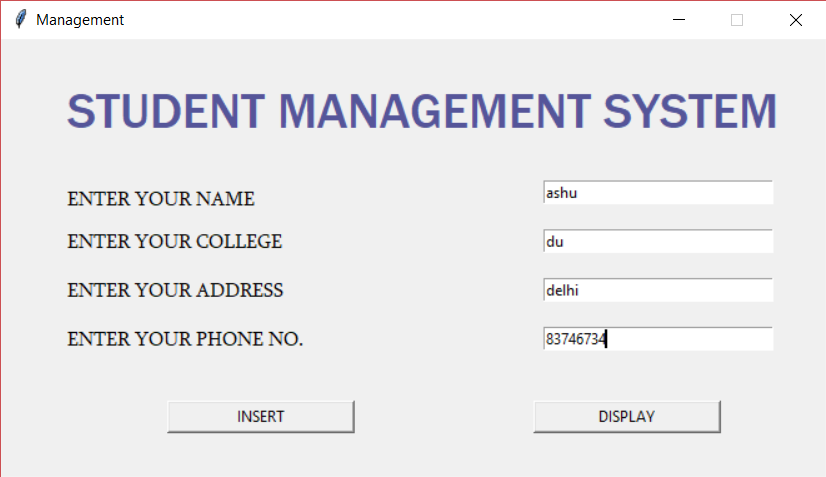
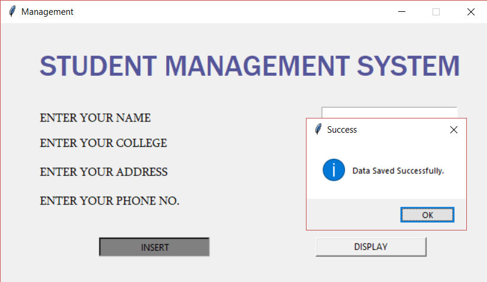
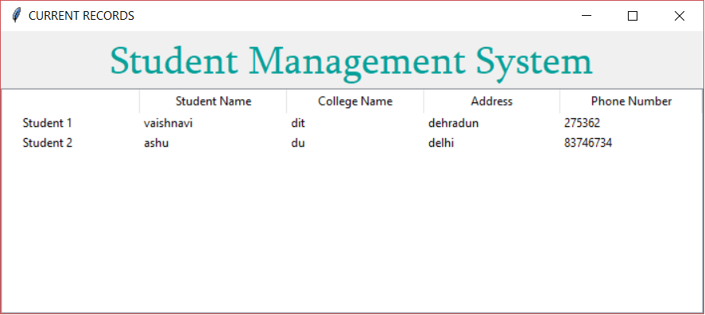

# Student-Management-System

1. Taking input from the user using tkinter(GUI).
2. Storing the information in a database.
3. Displaying the stored information.
4. Database connectivity using sqlite.

# # screenshots
  
  

